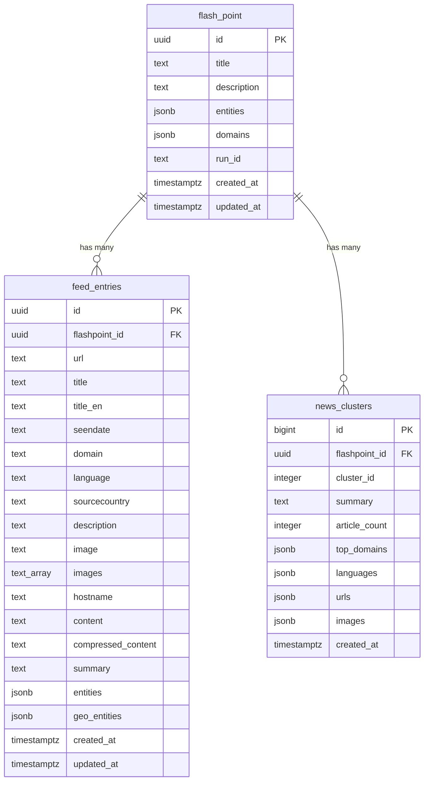

# MASX-GSGI

**Global Security & Geopolitical Intelligence** — High-throughput multilingual news ingestion + NLP enrichment pipeline.

[](https://github.com/AteetVatan/masx-geosignal)
[](https://python.org)
[](#license)

> **Repository:** [https://github.com/AteetVatan/masx-geosignal](https://github.com/AteetVatan/masx-geosignal)

---

## Table of Contents

- [Overview](#overview)
- [System Architecture](#system-architecture)
- [Pipeline Data Flow](#pipeline-data-flow)
- [Extraction Ensemble](#extraction-ensemble)
- [Job State Machine](#job-state-machine)
- [Clustering Design](#clustering-design)
- [Database Schema](#database-schema)
- [Pipeline Tiers](#pipeline-tiers)
- [Pipeline Modules](#pipeline-modules)
- [API Endpoints](#api-endpoints)
- [Technology Stack](#technology-stack)
- [Project Structure](#project-structure)
- [Quick Start](#quick-start)
- [CLI Commands](#cli-commands)
- [Cost Model](#cost-model)
- [Deployment](#deployment)
- [Testing](#testing)
- [Clawbot.ai Integration](#clawbotai-integration)
- [Documentation](#documentation)
- [License](#license)

---

## Overview

MASX-GSGI processes **10,000+ multilingual news URLs/day** through a fully automated NLP pipeline:

1. **Fetches** raw HTML via async HTTP (httpx HTTP/2) with domain-level circuit breakers
2. **Extracts** article text using a 4-method extraction ensemble (Trafilatura → readability-lxml → jusText → BoilerPy3)
3. **Detects language** using fastText LID model
4. **Translates** titles to English via argostranslate
5. **Extracts named entities** (NER) using `distilbert-base-multilingual-cased-ner-hrl`
6. **Resolves geo-entities** — LOC/GPE entities → ISO country codes via pycountry
7. **Deduplicates** content via SHA-256 exact hash + MinHash LSH near-duplicate detection
8. **Embeds** articles using sentence-transformers (`all-MiniLM-L6-v2`) → pgvector
9. **Clusters** per flashpoint using kNN graph + Union-Find connected components
10. **Summarizes** clusters via two-stage pipeline: local DistilBART pre-summary → LLM cluster synthesis (Together AI)
11. **Scores** hotspot intensity using 4-component weighted formula
12. **Alerts** via webhook/Slack dispatch
13. **Writes** final output to `news_clusters` table

---

## System Architecture

```
┌─────────────────────────────────────────────────────────────────────┐
│                        ORCHESTRATOR (Cron)                          │
│  Runs daily · Creates processing_run · Dispatches stages           │
└──────────┬──────────────┬──────────────┬──────────────┬────────────┘
           │              │              │              │
           ▼              ▼              ▼              ▼
   ┌──────────────┐ ┌───────────┐ ┌───────────┐ ┌──────────────┐
   │ INGEST       │ │ CLUSTER   │ │ SUMMARY   │ │ SCORE/ALERT  │
   │ WORKER       │ │ WORKER    │ │ WORKER    │ │ WORKER       │
   │              │ │           │ │           │ │              │
   │ fetch →      │ │ kNN graph │ │ local     │ │ hotspot      │
   │ extract →    │ │ union-find│ │ extractive│ │ scoring      │
   │ dedupe →     │ │ per FP_ID │ │ or Batch  │ │ alerts       │
   │ embed        │ │           │ │ LLM       │ │              │
   └──────┬───────┘ └─────┬─────┘ └─────┬─────┘ └──────┬───────┘
          │               │             │               │
          ▼               ▼             ▼               ▼
   ┌──────────────────────────────────────────────────────────────┐
   │                    POSTGRES (Supabase)                       │
   │                                                              │
   │  feed_entries        ←  existing (read + update content)     │
   │  flash_point         ←  existing (read-only)                 │
   │  news_clusters       ←  existing (write final output)        │
   │                                                              │
   │  processing_runs     ←  NEW (run tracking)                   │
   │  feed_entry_jobs     ←  NEW (per-entry state machine)        │
   │  feed_entry_vectors  ←  NEW (pgvector embeddings)            │
   │  feed_entry_topics   ←  NEW (IPTC classifications)           │
   │  cluster_members     ←  NEW (internal cluster links)         │
   └──────────────────────────────────────────────────────────────┘
```

### Upstream Integration

```
ai-global-signal-grid (upstream)       MASX-GSGI (this project)
────────────────────────────────       ────────────────────────────
flash_point_YYYYMMDD ──────────────►  FlashPointRepo (READ ONLY)
                                            │
feed_entries_YYYYMMDD ─────────────►  FeedEntryRepo
  (id, url, title, seendate,               │
   domain, language, sourcecountry,        ▼
   description, image)              ┌─────────────────────┐
                                    │   Enrichment Pipeline │
                                    ├─────────────────────┤
                                    │ 1. Fetch HTML        │
                                    │ 2. Extract text      │
                                    │ 3. Detect language   │
                                    │ 4. Translate title   │
                                    │ 5. Extract hostname  │
                                    │ 6. NER → entities    │
                                    │ 7. Geo → geo_entities│
                                    │ 8. Deduplicate       │
                                    │ 9. Compress          │
                                    │10. Embed (Tier B/C)  │
                                    └─────────┬───────────┘
                                              │
                                              ▼
                                    feed_entries_YYYYMMDD (WRITE BACK)
                                      (title_en, hostname, content,
                                       compressed_content, summary,
                                       entities, geo_entities, images)
                                              │
                                              ▼
                                    news_clusters_YYYYMMDD (OUTPUT)
                                      (flashpoint_id, cluster_id,
                                       summary, article_count,
                                       top_domains, languages,
                                       urls, images)
```

---

## Pipeline Data Flow

```
feed_entries (input)
    ↓
    ├── fetch raw HTML (httpx async, HTTP/2)
    ├── extract text (trafilatura → readability → jusText → boilerpy3)
    ├── detect language (fastText)
    ├── translate title (argostranslate)
    ├── extract hostname
    ├── NER (distilbert-multilingual)
    ├── geo-entity resolution (pycountry)
    ├── dedupe (SHA-256 → MinHash LSH)
    ├── compress (zstandard)
    ├── embed (sentence-transformers → pgvector)
    ├── cluster per flashpoint_id (kNN + Union-Find)
    ├── summarize per cluster (local DistilBART + LLM API)
    └── score + alert (hotspot formula)
         ↓
news_clusters (output)
```

---

## Extraction Ensemble

The pipeline uses a 4-method cascade to maximize extraction success:

```
                    Raw HTML
                       ↓
              ┌─── Trafilatura (favor_recall) ───┐
              │        ↓ (if < min_length)       │
              │   readability-lxml               │
              │        ↓ (if < min_length)       │
              │   jusText                        │
              │        ↓ (if < min_length)       │
              │   BoilerPy3                      │
              │        ↓ (if all fail)           │
              │   Detect reason:                 │
              │     js_required? → Playwright    │
              │     paywall? → mark & skip       │
              │     consent? → Playwright        │
              └──────────────────────────────────┘
```

---

## Job State Machine

Each `feed_entry` passes through these states per pipeline run:

```
QUEUED → FETCHING → EXTRACTED → DEDUPED → EMBEDDED → CLUSTERED → SUMMARIZED → SCORED
                                    ↓
                            SKIPPED_DUPLICATE

     Any state → FAILED (with failure_reason)
```

---

## Clustering Design

**Invariant**: Clusters are formed **strictly per `flashpoint_id`**.

1. For each `flashpoint_id`, gather all non-duplicate embedded entries
2. Build full cosine similarity matrix from normalized embeddings
3. For each entry, find k nearest neighbors above threshold
4. Use Union-Find to find connected components
5. Sort components by size (DESC)
6. Assign dense-rank `cluster_id` (1, 2, 3, ...)
7. Write to `cluster_members` and then aggregate to `news_clusters`

---

## Database Schema

### Date-Partitioned Tables (managed by upstream)

| Table Pattern | Access | Description |
|---|---|---|
| `flash_point_YYYYMMDD` | **Read-only** | Flashpoint/conflict definitions |
| `feed_entries_YYYYMMDD` | **Read + Write** | News entries; enrichment fields written back |
| `news_clusters_YYYYMMDD` | **Write** | Created on demand by this pipeline |

### Sidecar Tables (managed by Alembic)

| Table | Purpose |
|---|---|
| `processing_runs` | Tracks daily pipeline runs and their status/metrics |
| `feed_entry_jobs` | Per-entry state machine (queued → extracted → clustered → …) |
| `feed_entry_vectors` | Stores embeddings in pgvector with HNSW index |
| `feed_entry_topics` | IPTC Media Topic classifications |
| `cluster_members` | Links entries to internal cluster UUIDs |

### Enrichment Fields (written back to `feed_entries`)

| Field | Filled By | Description |
|---|---|---|
| `title_en` | `translate.py` | English translation of title |
| `hostname` | `translate.py` | Extracted from URL |
| `content` | `extract.py` | Full article text (serves as "processed" marker) |
| `summary` | `summarize.py` | Article/cluster summary |
| `entities` | `ner.py` | NER output (PERSON, ORG, LOC, GPE, etc.) |
| `geo_entities` | `geo.py` | Country-resolved locations with ISO codes |
| `images` | IngestService | Extracted from HTML (og:image, twitter:image, etc.) |

### Entity Relationship Diagram



---

## Pipeline Tiers

| Feature | Tier A (CPU-only) | Tier B (Balanced) | Tier C (Best) |
|---|:---:|:---:|:---:|
| Fetch + Extract | ✅ | ✅ | ✅ |
| Dedupe (SHA-256 + MinHash) | ✅ | ✅ | ✅ |
| Language Detection | ✅ | ✅ | ✅ |
| Title Translation | ✅ | ✅ | ✅ |
| NER + Geo-entities | ✅ | ✅ | ✅ |
| Metadata Storage | ✅ | ✅ | ✅ |
| Embeddings (pgvector) | ❌ | ✅ | ✅ |
| Clustering (kNN + Union-Find) | ❌ | ✅ | ✅ |
| Local Summaries (DistilBART) | ✅ (extractive) | ✅ | ✅ (fallback) |
| LLM Batch Summaries (Together AI) | ❌ | ❌ | ✅ |
| Premium LLM Pass (top 10%) | ❌ | ❌ | ✅ |
| Topic Classification (IPTC) | ✅ | ✅ | ✅ |
| Hotspot Scoring | ✅ | ✅ | ✅ |
| Monthly Cost (~10k URLs/day) | **~$6/mo** | **~$6/mo** | **~$7/mo** |

---

## Pipeline Modules

### Core Layer (`core/`)

| Module | Responsibility |
|---|---|
| `core/config/` | Pydantic Settings, logging setup |
| `core/db/engine.py` | Async SQLAlchemy engine with pgBouncer-compatible settings |
| `core/db/models.py` | ORM models for sidecar tables |
| `core/db/repositories.py` | CRUD repos — raw SQL for partitioned tables, ORM for sidecar |
| `core/db/table_resolver.py` | Dynamic table name resolution (`TableContext`) + `ensure_output_table` |
| `core/pipeline/fetch.py` | Async HTTP with concurrency control + domain circuit breakers |
| `core/pipeline/extract.py` | 4-method extraction ensemble + heuristics |
| `core/pipeline/lang.py` | fastText language identification |
| `core/pipeline/translate.py` | Title translation (argostranslate) + hostname extraction |
| `core/pipeline/ner.py` | Named Entity Recognition (distilbert-multilingual) |
| `core/pipeline/geo.py` | Geo-entity resolution — LOC/GPE → ISO country codes |
| `core/pipeline/dedupe.py` | SHA-256 + MinHash LSH deduplication |
| `core/pipeline/embed.py` | sentence-transformers embeddings → pgvector |
| `core/pipeline/topics.py` | ONNX IPTC topic classification |
| `core/pipeline/cluster.py` | kNN graph + Union-Find clustering |
| `core/pipeline/local_summarizer.py` | DistilBART local pre-summarization with ONNX + ProcessPoolExecutor (8 workers) |
| `core/pipeline/toml_serde.py` | Token-efficient TOML serialization for LLM I/O |
| `core/pipeline/summarize.py` | Two-stage: local DistilBART → LLM cluster synthesis (Together AI) |
| `core/pipeline/score.py` | Hotspot scoring algorithm (4-component weighted) |
| `core/pipeline/alerts.py` | Alert dispatch (webhook/Slack) |
| `core/pipeline/json_parse.py` | Fault-tolerant JSON parsing with repair |

### Apps Layer (`apps/`)

| Service | Type | Schedule | Description |
|---|---|---|---|
| `orchestrator` | Cron job | Daily 04:00 UTC | Creates processing run, dispatches all stages sequentially |
| `ingest_worker` | Worker | With orchestrator | Fetch + extract + NER + geo + dedupe + embed |
| `cluster_worker` | Worker | After ingestion | kNN graph + Union-Find clustering per flashpoint |
| `summary_worker` | Worker | After clustering | Local pre-summary + LLM cluster synthesis → `news_clusters` |
| `score_alert_worker` | Worker | After summarization | Hotspot scoring + alert dispatch |
| `api` | Web server | Always running | FastAPI trigger + status endpoints |

---

## API Endpoints

The FastAPI server provides pipeline trigger and monitoring endpoints:

| Method | Path | Auth | Description |
|---|---|---|---|
| `GET` | `/health` | No | Liveness check |
| `POST` | `/pipeline/run` | API key (`X-Api-Key`) | Trigger a pipeline run |
| `GET` | `/pipeline/runs?date=YYYY-MM-DD` | API key | List runs for a date |
| `GET` | `/pipeline/runs/{run_id}` | API key | Get status of a specific run |

**Safety features**: Rejects triggers if a pipeline is already running; auto-recovers runs stuck in `RUNNING` state for >2 hours.

```bash
# Trigger a pipeline run
curl -X POST http://localhost:8080/pipeline/run \
  -H "X-Api-Key: your-key" \
  -H "Content-Type: application/json" \
  -d '{"target_date": "2026-02-12", "tier": "B"}'

# Check run status
curl http://localhost:8080/pipeline/runs?date=2026-02-12 \
  -H "X-Api-Key: your-key"
```

---

## Technology Stack

| Component | Technology |
|---|---|
| Language | Python 3.12+ |
| Async HTTP | httpx (HTTP/2) + aiohttp |
| Database | SQLAlchemy 2.0 + asyncpg |
| Migrations | Alembic |
| Vector DB | pgvector (HNSW index) |
| Config | Pydantic Settings |
| Embedding | sentence-transformers (`all-MiniLM-L6-v2`) |
| Language ID | fastText LID |
| NER | distilbert-base-multilingual-cased-ner-hrl (HuggingFace transformers) |
| Geo Resolution | pycountry |
| Topics | ONNX IPTC classifier |
| Local Summarization | DistilBART CNN (PyTorch + ONNX via optimum) |
| Sentence Segmentation | BlingFire |
| Dedupe | datasketch MinHash LSH + simhash |
| LLM | Together AI — Llama 3.2 3B Instruct Turbo (OpenAI-compatible SDK) |
| Compression | zstandard |
| JSON Parsing | orjson + json-repair + python-rapidjson + pyjson5 |
| Logging | structlog (JSON) + rich (console) |
| CLI | Click |
| API | FastAPI + Uvicorn |
| Browser Automation | Playwright (optional, for JS-heavy sites) |
| Translation | argostranslate (optional, offline) |
| Testing | pytest + pytest-asyncio + pytest-cov + factory-boy + faker |
| Linting | Ruff |
| Type Checking | MyPy (strict mode) |
| Containerization | Docker + Docker Compose |
| Container Registry | GHCR (`ghcr.io/ateetvatan/masx-geosignal`) |
| Deploy | Railway (cron services) or self-hosted VPS |

---

## Project Structure

```
MASX-GSGI/
├── apps/
│   ├── orchestrator/          # Daily run coordinator (cron)
│   ├── ingest_worker/         # Fetch + extract + NER + geo + dedupe + embed
│   ├── cluster_worker/        # kNN clustering per flashpoint
│   ├── summary_worker/        # Summarize clusters → news_clusters
│   ├── score_alert_worker/    # Hotspot scoring + alerts
│   └── api/                   # FastAPI trigger + status endpoints
├── core/
│   ├── config/                # Pydantic Settings + logging
│   ├── db/
│   │   ├── engine.py          # Async SQLAlchemy engine (pgBouncer-compatible)
│   │   ├── models.py          # ORM models for sidecar tables
│   │   ├── repositories.py    # CRUD repos (raw SQL for partitioned tables)
│   │   └── table_resolver.py  # Dynamic table name resolution
│   └── pipeline/
│       ├── fetch.py           # Async HTTP + circuit breakers
│       ├── extract.py         # 4-method extraction ensemble
│       ├── lang.py            # fastText language detection
│       ├── translate.py       # Title translation + hostname extraction
│       ├── ner.py             # Named Entity Recognition
│       ├── geo.py             # Geo-entity resolution
│       ├── dedupe.py          # SHA-256 + MinHash LSH
│       ├── embed.py           # Sentence embeddings → pgvector
│       ├── topics.py          # IPTC topic classification
│       ├── cluster.py         # kNN + Union-Find clustering
│       ├── local_summarizer.py # DistilBART with ONNX + multiprocessing
│       ├── summarize.py       # Two-stage summarization pipeline
│       ├── toml_serde.py      # TOML serialization for LLM I/O
│       ├── score.py           # Hotspot scoring
│       ├── alerts.py          # Alert dispatch
│       └── json_parse.py      # Fault-tolerant JSON parsing
├── tests/                     # Unit + integration + e2e tests
├── docs/
│   ├── ARCHITECTURE.md        # System design, data flow, module boundaries
│   ├── SETUP.md               # Full setup guide (local + Docker + production)
│   ├── RUNBOOK.md             # Deployment, operations, health checks
│   ├── COST_MODEL.md          # Per-tier cost breakdowns
│   ├── TROUBLESHOOTING.md     # Common issues + performance tuning
│   ├── CLAWBOT_INTEGRATION.md # AI assistant integration (10 use cases)
│   └── initial_db.md          # Database schema + ER diagram
├── scripts/
│   ├── seed_debug_data.py     # Seed realistic debug data
│   ├── seed_mini_data.py      # Minimal seed data
│   ├── reset_entries.py       # Reset entries for reprocessing
│   └── export_onnx.py         # Export DistilBART to ONNX format
├── alembic/                   # Database migrations
├── models/                    # Downloaded NLP models (runtime)
├── Dockerfile                 # CPU-optimized image (~4.4 GB)
├── docker-compose.yml         # Local dev (Postgres + pipeline + API)
├── pyproject.toml             # Dependencies + tool configs
├── .env.example               # Environment variable template
└── .gitignore
```

---

## Quick Start

### Prerequisites

- Python ≥ 3.12
- Docker + Docker Compose (for database)
- Git

### Setup

```bash
# Clone
git clone https://github.com/AteetVatan/masx-geosignal.git
cd MASX-GSGI

# Configure
cp .env.example .env
# Edit .env with your Supabase credentials

# Start database
docker compose up -d db

# Install dependencies
pip install -e ".[dev]"

# Run migrations
alembic upgrade head

# (Optional) Export ONNX model for 2× faster local summarization
python scripts/export_onnx.py

# Seed debug data
python scripts/seed_debug_data.py --date 2026-02-12

# Run pipeline
python -m apps.orchestrator.main --tier A --date 2026-02-12

# Start API server
uvicorn apps.api.main:app --host 0.0.0.0 --port 8080
```

### Docker Setup

```bash
docker compose up -d db           # Start Postgres + pgvector
docker compose run --rm migrate   # Run migrations
docker compose up pipeline        # Run pipeline
docker compose up api             # Start API server
```

---

## CLI Commands

After `pip install -e .`, the following CLI commands are available:

| Command | Description |
|---|---|
| `gsgi-orchestrator --tier A --date YYYY-MM-DD` | Run full pipeline |
| `gsgi-ingest --date YYYY-MM-DD` | Run ingest worker only |
| `gsgi-cluster <run_id> --date YYYY-MM-DD` | Run cluster worker only |
| `gsgi-summarize <run_id> --date YYYY-MM-DD` | Run summary worker only |
| `gsgi-score <run_id> --date YYYY-MM-DD` | Run score/alert worker only |
| `gsgi-api --port 8080` | Start API server |

---

## Cost Model

### Daily Costs (10,000 URLs/day)

| Tier | Features | Daily | Monthly | Annual |
|---|---|---|---|---|
| **A** (CPU-only) | Fetch + Extract + Dedupe + NER + Geo + Translation | $0.19 | **$5.70** | $68 |
| **B** (Balanced) | + Embeddings + Clustering + Local Summaries | $0.21 | **$6.30** | $76 |
| **C** (Best quality) | + LLM Summaries (Together AI) + Premium Pass | $0.22 | **$6.60** | $79 |

### Cost Breakdown

```
Tier A:  ████████████████████████████ Compute(7%) + Network(93%)
Tier B:  ████████████████████████████ Compute(13%) + Network(86%) + Storage(1%)
Tier C:  ████████████████████████████ Compute(8%) + Network(51%) + LLM(34%) + Storage(7%)
```

### Cost Optimization Strategies

- **Dedupe-first**: Skip embeddings/clustering for duplicates (~20-30% savings)
- **Cluster-first, then summarize**: 1 summary per cluster vs 1 per article (~80% LLM savings)
- **Translate summaries only**: Not full article content (~90% translation savings)
- **Local embeddings**: sentence-transformers on CPU = $0 per embedding
- **Together AI**: $0.06/1M tokens with Llama 3.2 3B
- **Provider-agnostic**: Swap to any OpenAI-compatible API via env vars
- **Tiered pipeline**: Only pay for what you need

> **30-50× cheaper** than naive per-article LLM approaches ($6.60/mo vs ~$300/mo with GPT-4o).

---

## Deployment

### Railway

| Service | Command | Schedule |
|---|---|---|
| `gsgi-orchestrator` | `python -m apps.orchestrator.main` | `0 4 * * *` (daily 4 AM UTC) |
| `gsgi-api` | `uvicorn apps.api.main:app --host 0.0.0.0 --port $PORT` | Always running |

### Self-Hosted (Docker / VPS)

```bash
# Build & push to GHCR
docker build -t ghcr.io/ateetvatan/masx-geosignal:latest .
docker push ghcr.io/ateetvatan/masx-geosignal --all-tags

# Production deployment
docker compose -f docker-compose.prod.yml run --rm migrate
docker compose -f docker-compose.prod.yml up -d api
docker compose -f docker-compose.prod.yml run --rm pipeline
```

### Environment Variables

| Variable | Required | Description |
|---|---|---|
| `DATABASE_URL` | ✅ | Async connection string (`postgresql+asyncpg://...`) |
| `DATABASE_URL_SYNC` | ✅ | Sync connection string for Alembic (`postgresql://...`) |
| `PIPELINE_TIER` | ❌ | `A`, `B`, or `C` (default: `A`) |
| `LLM_API_KEY` | Tier C | Together AI API key |
| `LLM_BASE_URL` | ❌ | LLM endpoint (default: `https://api.together.xyz/v1`) |
| `LLM_MODEL` | ❌ | Model name (default: `meta-llama/Llama-3.2-3B-Instruct-Turbo`) |
| `PIPELINE_API_KEY` | ❌ | API authentication key |
| `MAX_CONCURRENT_FETCHES` | ❌ | HTTP concurrency (default: `50`) |
| `PER_DOMAIN_CONCURRENCY` | ❌ | Per-domain limit (default: `3`) |
| `EMBEDDING_BATCH_SIZE` | ❌ | Batch size for embeddings (default: `64`) |
| `LOCAL_SUMMARIZER_WORKERS` | ❌ | Parallel DistilBART workers (default: `8`) |
| `MINHASH_THRESHOLD` | ❌ | Near-duplicate threshold (default: `0.8`) |
| `CLUSTER_COSINE_THRESHOLD` | ❌ | Clustering similarity threshold (default: `0.65`) |
| `CLUSTER_KNN_K` | ❌ | kNN neighbors (default: `10`) |
| `LOG_LEVEL` | ❌ | `DEBUG`, `INFO`, `WARNING` (default: `INFO`) |
| `LOG_FORMAT` | ❌ | `json` or `console` (default: `json`) |
| `PLAYWRIGHT_ENABLED` | ❌ | Enable browser for JS-heavy sites (default: `false`) |

---

## Testing

```bash
# Unit tests only
pytest -v -m "not integration and not e2e and not slow"

# All tests
pytest -v

# With coverage
pytest --cov=core --cov=apps --cov-report=term-missing

# Linting
ruff check .
ruff format --check .

# Type checking
mypy core/ apps/ --ignore-missing-imports
```

---

## Clawbot.ai Integration

MASX-GSGI can be enhanced with [Clawbot.ai](https://clawbot.ai) — an open-source AI assistant that adds conversational control and proactive monitoring:

| Capability | Description |
|---|---|
| **Pipeline Triggering** | Trigger runs via WhatsApp/Telegram: _"run pipeline tier C"_ |
| **Daily Reports** | Automated digests: articles processed, clusters, failures, cost |
| **Hotspot Alerts** | Real-time alert delivery to WhatsApp/Telegram/Slack/Discord |
| **Health Monitoring** | Proactive DB/API/disk alerts every 30 minutes |
| **Log Analysis** | Conversational: _"what failed in today's run?"_ |
| **Trend Analysis** | Weekly geopolitical trend reports |
| **On-Demand DevOps** | _"switch to tier A"_, _"run migrations"_, _"show last 5 runs"_ |
| **Translation Monitoring** | Track translation coverage and quality |
| **Automated CI/CD** | Test + deploy from a chat message |
| **DB Maintenance** | Automated weekly vacuum, index updates, size reporting |

See [`docs/CLAWBOT_INTEGRATION.md`](docs/CLAWBOT_INTEGRATION.md) for full integration report with 10 detailed use cases.

---

## Documentation

| Document | Description |
|---|---|
| [Architecture](docs/ARCHITECTURE.md) | System design, data flow, module boundaries, tiered pipeline |
| [Setup Guide](docs/SETUP.md) | Full setup (local + Docker + production deployment) |
| [Runbook](docs/RUNBOOK.md) | Deployment, operations, health checks, scaling |
| [Cost Model](docs/COST_MODEL.md) | Per-tier cost breakdowns and optimization strategies |
| [Troubleshooting](docs/TROUBLESHOOTING.md) | 10 common issues + performance tuning guide |
| [Clawbot Integration](docs/CLAWBOT_INTEGRATION.md) | AI assistant integration report |
| [Database Schema](docs/initial_db.md) | Table structures + ER diagram |

---

## License

Proprietary — All rights reserved.
