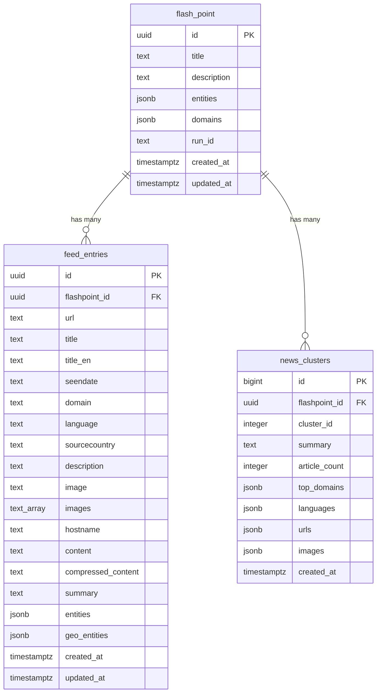

# Supabase Database Schema

> **Database:** `postgresql://postgres.uejhhobzicbxysgmlduc@aws-0-eu-central-1.pooler.supabase.com:6543/postgres`
> **Snapshot date:** 2026-02-12

## Overview

- **Total tables:** 218 (2 regular + 3 date-partitioned groups)
- **Custom enums:** None
- **Custom functions:** None
- **Views:** None

---

## Date-Partitioned Table Groups

| Group | Partitions | Date Range | Total Rows |
|-------|-----------|------------|------------|
| `feed_entries_YYYYMMDD` | 102 | 2025-07-01 → 2025-11-03 | **878,387** |
| `flash_point_YYYYMMDD` | 102 | 2025-07-01 → 2025-11-03 | **755** |
| `news_clusters_YYYYMMDD` | 12 | 2025-07-01 → 2025-09-18 | **7** |

---

## Table Structures

### 1. `flash_point` (core conflict/flashpoint data)

| Column | Type | Nullable | Default |
|--------|------|----------|---------|
| **id** | uuid | NO | `gen_random_uuid()` |
| **title** | text | NO | — |
| **description** | text | NO | — |
| entities | jsonb | YES | — |
| domains | jsonb | YES | — |
| run_id | text | YES | — |
| created_at | timestamptz | YES | `now()` |
| updated_at | timestamptz | YES | `now()` |

- **PK:** `id`

---

### 2. `feed_entries` (news articles linked to flashpoints)

| Column | Type | Nullable | Default |
|--------|------|----------|---------|
| **id** | uuid | NO | `gen_random_uuid()` |
| flashpoint_id | uuid | YES | — |
| url | text | YES | — |
| title | text | YES | — |
| title_en | text | YES | — |
| seendate | text | YES | — |
| domain | text | YES | — |
| language | text | YES | — |
| sourcecountry | text | YES | — |
| description | text | YES | — |
| image | text | YES | — |
| images | text[] | YES | `'{}'` |
| hostname | text | YES | — |
| content | text | YES | — |
| compressed_content | text | YES | — |
| summary | text | YES | — |
| entities | jsonb | YES | — |
| geo_entities | jsonb | YES | — |
| created_at | timestamptz | YES | `now()` |
| updated_at | timestamptz | YES | `now()` |

- **PK:** `id`
- **FK:** `flashpoint_id` → `flash_point.id`

---

### 3. `news_clusters` (clustered news summaries per flashpoint)

| Column | Type | Nullable | Default |
|--------|------|----------|---------|
| **id** | bigint | NO | auto-increment |
| flashpoint_id | uuid | NO | — |
| cluster_id | integer | NO | — |
| summary | text | NO | — |
| article_count | integer | NO | — |
| top_domains | jsonb | YES | `'[]'` |
| languages | jsonb | YES | `'[]'` |
| urls | jsonb | YES | `'[]'` |
| images | jsonb | YES | `'[]'` |
| created_at | timestamptz | YES | `CURRENT_TIMESTAMP` |

- **PK:** `id`

---

### 4. `test_table` (1 row — likely for testing)

| Column | Type | Nullable | Default |
|--------|------|----------|---------|
| **id** | uuid | NO | `gen_random_uuid()` |
| name | text | NO | — |
| created_at | timestamptz | YES | `now()` |

---

### 5. `feed_entries_20250702_duplicate` (0 rows — likely migration leftover)

Same structure as `feed_entries`.

---

## RLS Policies

All partitioned tables have **identical RLS policies**:

| Policy | Command | Type | Roles |
|--------|---------|------|-------|
| `allow_select` | SELECT | PERMISSIVE | `anon`, `authenticated` |
| `allow_insert` | INSERT | PERMISSIVE | `anon`, `authenticated` |
| `allow_update` | UPDATE | PERMISSIVE | `anon`, `authenticated` |
| `allow_delete` | DELETE | PERMISSIVE | `anon`, `authenticated` |

Some tables also have an additional `Allow read access to all users` (SELECT, PERMISSIVE) policy for the `public` role.

---

## Entity Relationship Diagram

